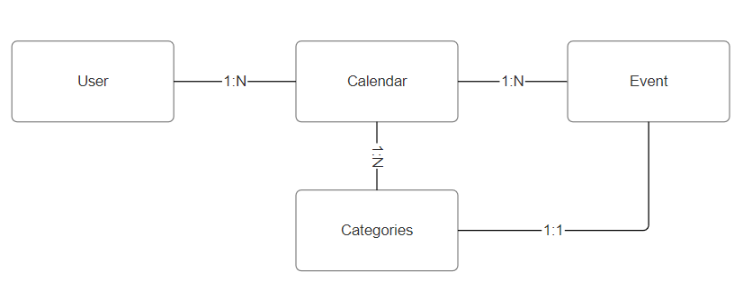
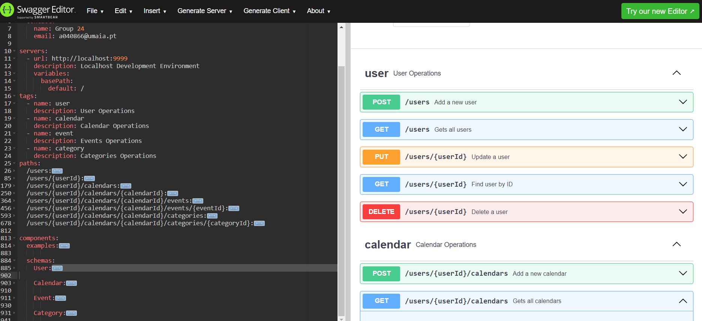
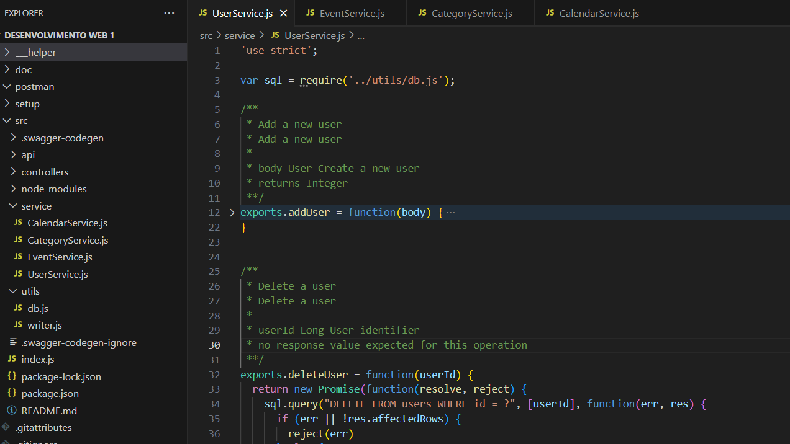
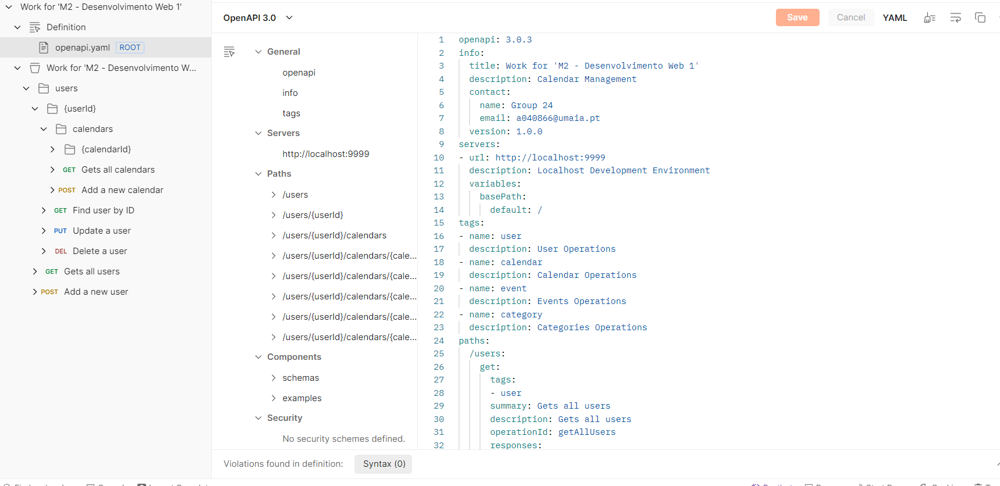
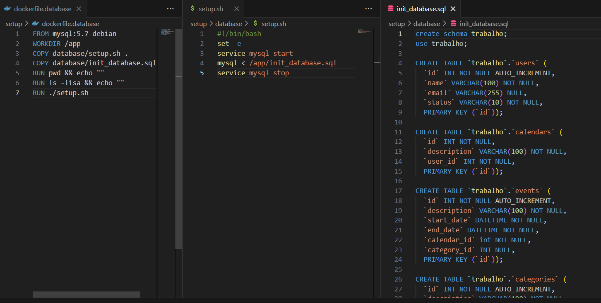
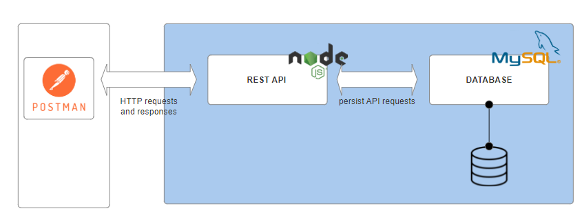

# C3 : Product

## 3.1 Development

After deciding on the theme, the product development was executed in the following way:

1. We've started by the resources organization and connections, that lead us to the following diagram:



2. After that, the work on the Open API specification was started. 



3. Once the definition was aligned, we've downloaded the generated code from the swagger editor and started to make the implementation of the several services and integration with the mysql database



4. While developing the several services, the REST API was being tested with calls from te Postman software.



5. When we were reaching the end of the API developments, we've started the configuration of the environment using docker. Initially only with the mysql image loaded with scripts to create the database and load demo data.



6. Finally we've ended up with the following system architecture.



## 3.2 Instalation

The installation process is very easy due to the use of docker. The only thing we need to install in the machine is 'Docker for Desktop'.

After the installation, we just need to open a terminal and on the src folder execute:

```
docker-compose up
```  

## 3.3 Usage

No special notes in this section.

## 3.4 Implementation details

It was a group decision to support the request body in multiple formats (usually JSON/XML/x-www-form-enconded) but the response would always be in JSON.

Examples were included in the OpenAPI definition.

The postman collection contains a demo folder with several examples for each resource

The docker hub images are prensent in: 
- inf23dw1g24/mysql
- inf23dw1g24/api


---
[< Previous](c2.md) | [^ Main](../../../) | [Next >](c4.md)
:--- | :---: | ---: 